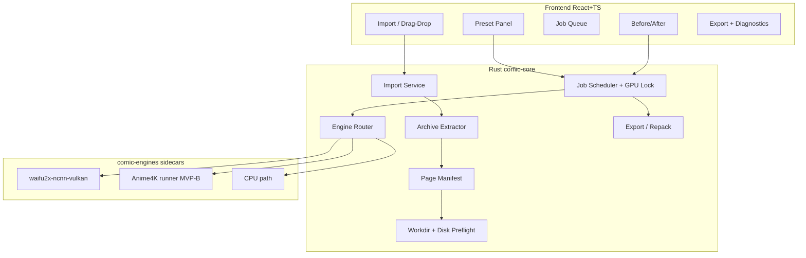
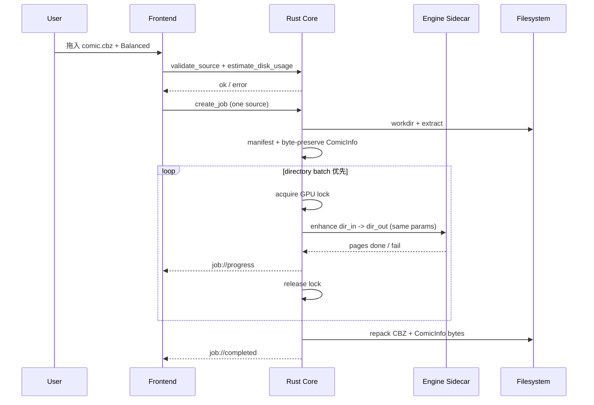
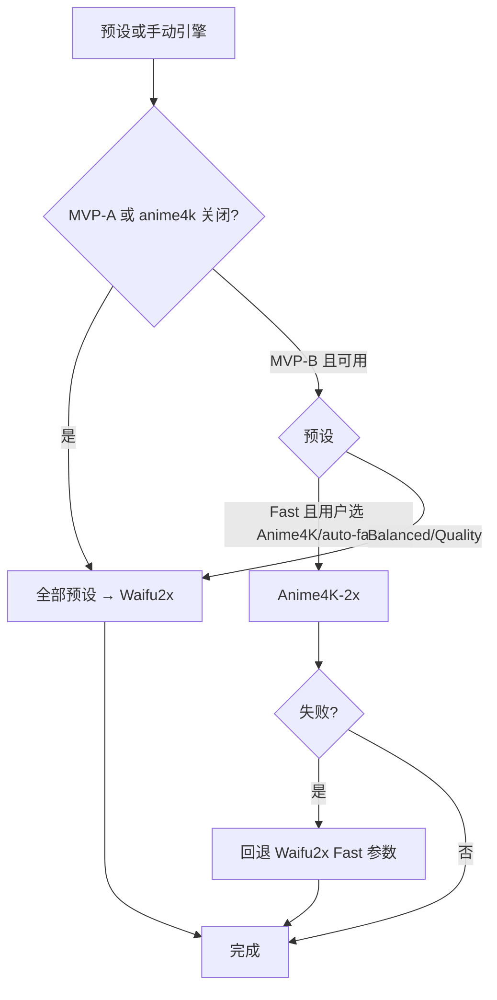
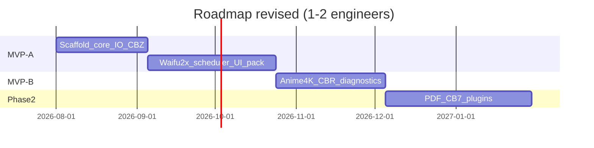
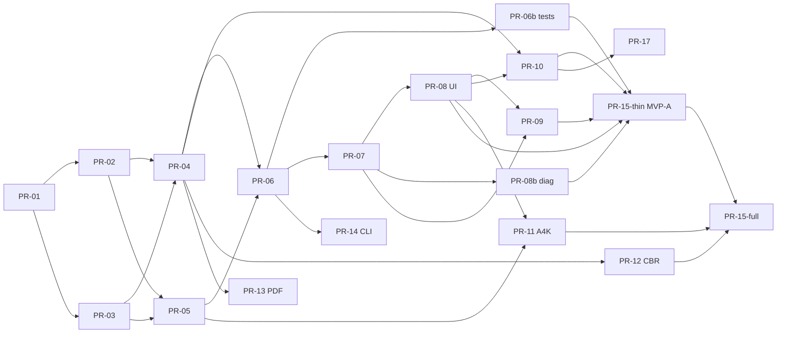

# 漫画画质增强工具 — 技术设计文档

| 字段 | 内容 |
|------|------|
| **文档标题** | Comic Image Quality Enhancement Tool — Design Document |
| **产品名称** | PureComic（内部 crate：`comic-core` / `comic-engines` / `comic-cli`） |
| **作者** | TBD（Tech Lead 待指定；建议引擎打包由一人专责） |
| **日期** | 2026-08-12 |
| **修订** | 2026-08-14 r4（目录/CLI/工作目录路径对齐 PureComic） |
| **状态** | Draft（实现已超 MVP-A，本文仍为设计基线） |
| **受众** | 产品负责人 + 实现工程师 |
| **工作区** | 仓库根目录 `PureComic/`（GitHub: `dongsheng512/PureComic`） |
| **人力假设** | **1–2 名全职工程师**；下文工期按此估算 |
| **ADR 目录** | 决策落地后写入 `docs/adr/`（见 Key Decisions 映射） |

---

## Overview

个人收藏者、扫描组与内容创作者常持有分辨率偏低、扫描噪点多或压缩严重的漫画资源。现有通用超分工具（Upscayl、Waifu2x-GUI 等）虽能处理单图，但对 **漫画容器格式的批量导入、页级流水线、再打包导出** 支持不足；节点工具（Chainner）学习成本高，不适合「拖入 → 选预设 → 导出」的日常工作流。

本设计提出一款 **本地优先（Local-first）桌面应用**：**Tauri 2 + Rust 核心管线 + React/TypeScript UI**，以 **Waifu2x（ncnn-Vulkan sidecar）** 为唯一 GA 必达引擎，完成 **导入 → 解包页图 → 增强 → 重组导出**。

**发布列车（冻结）：**

| 列车 | 代号 | 范围摘要 |
|------|------|----------|
| **MVP-A（Thin GA，必达）** | 单引擎可交付 | Folder / ZIP / CBZ · JPEG/PNG/WebP · **仅 Waifu2x** · 队列/取消/resume · Before/After · 导出 CBZ/Folder · 中文 UI |
| **MVP-B（Full / 可选 beta）** | 双引擎 + 格式扩展 | **Anime4K-2x**（平台矩阵内）· **CBR（系统 unrar）** · 诊断包完善 · 功能旗标默认关或 beta 通道 |
| **Phase 2+** | 增强 | PDF、CB7/7z、CBT/TAR、AVIF、ComicInfo 结构化编辑、Real-ESRGAN 插件、书库等 |

**产品一句话（与 MVP-A 对齐）：** 本地 CBZ/文件夹漫画一键 Waifu2x 增强并导出，可预览、可批量、可取消。

---

## Background & Motivation

### 当前状态

- 仓库为 **greenfield**，无遗留代码；monorepo 布局见下文（净新建）。
- 用户需求提及 **Waifu2x** 与 **Anime4K-2x**；工程上 **Waifu2x 为 MVP-A 硬依赖**，Anime4K 为 **MVP-B 可失败项**（见 Key Decisions）。
- 漫画介质：散图目录、ZIP/CBZ、RAR/CBR、7z/CB7、TAR/CBT、PDF；常带 `ComicInfo.xml`。

### 痛点

| 痛点 | 说明 |
|------|------|
| 格式碎片化 | 扫描组多为 CBR/CBZ；个人可能是 PDF 或文件夹；反复解压/再打包 |
| 批量成本高 | 单本 50–300+ 页，无任务队列与内存控制时易 OOM |
| 引擎门槛高 | noise / scale / tile 对非技术用户不友好 |
| 隐私与成本 | 云端超分需上传版权内容并计费 |
| 质量可控性 | 缺前后对比时整本白跑浪费 GPU |

### 机会

- Manga-first 容器管线 + 二次元向超分，填补通用单图工具空白。
- Vulkan 跨厂商 GPU 覆盖 Win/Linux；macOS 走明确 ship gate（见 GPU 矩阵）。

---

## Goals & Non-Goals

### Goals（按阶段标注）

| # | 目标 | 阶段 |
|---|------|------|
| G1 | **Waifu2x** 画质增强（去噪 + 1×/2×），质量/速度预设，CPU 可回退 | **MVP-A** |
| G2 | **Anime4K-2x** 作为 Fast 可选引擎（轻量锐化/重建，**非** Waifu2x 级神经网络去噪） | **MVP-B**（≥1 平台验收后） |
| G3 | 漫画导入：**Folder、ZIP、CBZ** | **MVP-A** |
| G4 | 漫画导入：**CBR/RAR**（系统 unrar，不捆绑 RAR 位） | **MVP-B** |
| G5 | 漫画导入：**PDF** 光栅化 | **Phase 2**（feature flag 可先做 beta） |
| G6 | 漫画导入：**7z/CB7**；**TAR/CBT** | **Phase 2** |
| G7 | 图片 I/O：**JPEG、PNG、WebP**（读写）；BMP 只读 | **MVP-A** |
| G8 | 图片：静态 GIF 只读（首帧+警告）；TIFF/AVIF | **Phase 2**（GIF 可读可进 MVP-B） |
| G9 | 端到端流水线：进度、取消、页级 resume、Before/After 预览、导出 CBZ/Folder | **MVP-A** |
| G10 | 本地优先：默认不上传；**sidecar + models-cunet 随包分发** + SHA-256 校验 | **MVP-A** |
| G11 | CLI 与 core 同逻辑 | **MVP-A 末期或紧随 thin GA** |
| G12 | 增量交付：MVP-A → MVP-B → Phase 2/3 可独立验收 | 全程 |

### Non-Goals

| 项目 | 阶段 |
|------|------|
| 在线图床 / 账号 / 社交 | 不做（V1） |
| 完整漫画库（标签、阅读进度、多设备同步） | Phase 3 |
| 视频超分、帧插值 | 不做 |
| Real-ESRGAN 等引擎全家桶 | Phase 2 插件 |
| OCR 嵌字、专业去网纹 | 非核心 |
| 移动端 / 纯 Web GPU 推理 | 非 MVP |
| DRM 破解 | **永不做** |

### MVP-A 退出清单（Thin GA — 冻结）

必须全部满足方可标为 **MVP-A GA**：

- [ ] 安装包：至少 **Windows x64** + **macOS arm64** + **Linux x64**（macOS x64 为 best-effort）
- [ ] 导入：**Folder / ZIP / CBZ**；页序正确；zip 安全限额生效
- [ ] 图片：**JPEG / PNG / WebP** 输入；导出 PNG / JPEG(q 可调，默认 92) / WebP / same-as-source
- [ ] 引擎：**仅 Waifu2x**（bundled sidecar + `models-cunet`）；scale **1|2**；预设 Fast/Balanced/Quality **均映射 Waifu2x 参数**
- [ ] 任务：单 job GPU 锁；进度 + ETA；取消（杀进程组）；页级 resume；**一源一 job**
- [ ] UI：拖放、队列、预设、导出目录、Before/After；**默认简体中文**
- [ ] 默认导出：`{stem}_x2.cbz`（或 `_x1`），**禁止静默覆盖源文件**
- [ ] ComicInfo.xml：**字节级透传**（若源 CBZ 含有）；MVP-A 不要求解析改 PageCount
- [ ] 首次启动：引擎/模型 SHA-256 失败 → **明确错误**，不静默降级到「假 GPU 成功」
- [ ] 参考 fixture 上记录 pages/s（见 Success Metrics）；磁盘预检拒绝空间不足任务
- [ ] About / `third_party/NOTICE` 列出上游许可

**MVP-B 增量清单（不阻塞 MVP-A GA）：**

- [ ] Anime4K-2x 在平台矩阵 `yes` 的 OS 上可用；文案标明「轻量锐化」；否则 UI 隐藏/灰显
- [ ] CBR：检测系统 `unrar`/`UnRAR`；缺失则中文引导安装；不捆绑 UnRAR 二进制
- [ ] 诊断包导出；设置页 GPU/引擎自检面板

---

## Feature Evaluation（功能评估）

### 目标用户

| 用户群 | 诉求 | 关键场景 | 格式优先级 |
|--------|------|----------|------------|
| **个人漫画收藏者** | 低清源提升可读 | CBZ/文件夹 → 2× 后平板阅读 | CBZ、PDF（后） |
| **扫描组（Scanlation）** | 统一画质、规范导出 | 整卷批处理 + **元数据不丢** | **CBR/CBZ** 优先 |
| **内容创作者** | 散图快速出图 | 预览 + 高质量 PNG/WebP | Folder |

**MVP-B 格式优先序（扫描组为主 persona）：** CBR > PDF。PDF 因原生依赖与许可成本放入 Phase 2。

### 竞品简表

| 产品 | 优势 | 劣势 | 与本产品差异 |
|------|------|------|--------------|
| **Waifu2x-Extension-GUI** | 画质/批处理成熟、Vulkan | 漫画容器弱、UX 重 | 容器管线 + 漫画预设；见下方 **parity 清单** |
| **Upscayl** | 开源桌面易用 | Real-ESRGAN 偏通用 | 二次元引擎 + CBZ 往返 |
| **Chainner** | 节点极强 | 学习曲线陡 | 一键工作流 |
| **Magpie / MPV+Anime4K** | 实时观看优秀 | 非离线存盘批处理 | 我们做导出向；Anime4K 仅 MVP-B |
| **商业云超分** | 零安装 | 隐私/费用 | 本地批处理 |

**与 Waifu2x-Extension-GUI 的 MVP-A 能力对照（parity，非全部追平）：**

| 能力 | Extension-GUI | 本产品 MVP-A |
|------|---------------|--------------|
| Waifu2x 去噪+2× | ✅ | ✅ |
| 目录/多图批处理 | ✅ | ✅（经容器/文件夹） |
| CBZ 导入导出 | 弱/外置 | ✅ 一等公民 |
| 前后对比预览 | 有 | ✅ |
| 多引擎全家桶 | 有 | ❌（Phase 2 插件） |
| 视频 | 有 | ❌ Non-Goal |

### 核心功能 vs Nice-to-have

| 优先级 | 功能 | 列车 |
|--------|------|------|
| P0 | Folder / ZIP / CBZ 导入导出 | MVP-A |
| P0 | JPEG/PNG/WebP | MVP-A |
| P0 | Waifu2x + 三档预设（均 Waifu2x） | MVP-A |
| P0 | 队列、进度、取消、页级 resume | MVP-A |
| P0 | Before/After 预览 | MVP-A |
| P0 | ComicInfo **字节透传** | MVP-A |
| P1 | 输出质量高级选项 UI | MVP-A（PR-10） |
| P1 | CBR + 系统 unrar | MVP-B |
| P1 | Anime4K-2x + 文案降噪预期 | MVP-B |
| P1 | 诊断包 / 自检 UI | MVP-B（自检面板可提前到 MVP-A 末期） |
| P2 | PDF、7z/CB7、TAR/CBT、AVIF、TIFF | Phase 2 |
| P2 | ComicInfo 结构化读写 / PageCount | Phase 2（PR-17） |
| P2 | Real-ESRGAN-ncnn 插件 | Phase 2 |
| P3 | 书库、阅读器、headless 服务 | Phase 3 |

### 成功指标（Success Metrics）

#### 参考 Fixture（性能与完成率唯一官方口径）

| 字段 | 值 |
|------|-----|
| **名称** | `testdata/fixtures/ref_cbz_100` |
| **页数** | 100 |
| **单页** | 约 **1200×1800** JPEG，约 **80 KB/页**（灰度或 RGB 均可；fixture 固定一种并写入 README） |
| **包体** | 约 **8 MB** CBZ |
| **任务参数** | preset=**Balanced**，engine=**waifu2x**，scale=**2**，noise=**1**，tile=**auto**，concurrency=**1**，TTA=**off** |

| 指标 | 目标 |
|------|------|
| **任务完成率** | 上述 fixture ≥ **99%** 成功（非用户取消）；另：合成 1000 页同规格压力测无崩溃（可 mock 引擎测调度） |
| **性能（仅 fixture 报数）** | 在 **NVIDIA RTX 3060 12GB / Win11** 与 **Apple M2 / macOS** 上各测一次 Balanced，**写入发布说明**（不在文档写死 1–4 页/秒；预期量级约 0.5–3 页/s，视驱动与 tile） |
| **其它分辨率** | 明确标注 **varies with resolution**；webtoon 长条/4000px 扫描不保证同吞吐 |
| **内存** | **稳态页 worker（core+sidecar，concurrency=1，fixture 尺寸）目标 &lt; 4 GB**；不含整个 OS；**大单页/预览解码可能导致尖峰**，OOM 时自动降 tile |
| **磁盘** | 见下方估算公式；空间不足 → 创建任务失败并中文提示 |
| **可用性** | 新用户 5 分钟完成「导入→预设→导出」 |
| **页序** | 100% 与源一致 |
| **稳定性** | 取消后无僵尸 GPU 进程；连续 1000 页（fixture 重复或 mock）无崩溃 |

#### 临时磁盘估算（替代「0.5–2× 包体」）

JPEG 扫描解压为工作格式时 **膨胀极大**（常见 **5–15×** 相对 JPEG 体积）。

```text
# 预检（创建 job 前）
decoded_rgba_bytes ≈ width * height * 4 * page_count   # 按探测到的解码尺寸；未知则用上限假设
# 若内部为 PNG/无损 WebP，磁盘约：
work_bytes ≈ decoded_rgba_bytes * compress_factor_in   # PNG 经验 0.3–0.8；预检用保守 1.0（按未压缩 RGBA）
out_bytes  ≈ decoded_rgba_bytes * scale^2 * compress_factor_out
estimate_bytes ≈ (work_bytes + out_bytes) * safety(1.2)
             + archive_extract_overhead

# MVP-A 实现简化（可落地）：
# 1) 抽样解码最多 N 页得平均 w,h
# 2) estimate = avg_w * avg_h * 4 * pages * (1 + scale^2) * 1.2
# 3) if estimate > free_space(workdir) OR estimate > user_cap_gb → reject
```

UI：当 `estimate > 5 GB` 或 `estimate > 50% free` 时 **警告**；`estimate > free` 时 **硬失败**。

---

## Proposed Design

### 总体架构

**推荐：Tauri 2 + Rust core + React/TypeScript UI + 可选 CLI**

| 方案 | 结论 | 理由 |
|------|------|------|
| **Tauri 2 + Rust** | ✅ 主方案 | 包体/内存优；IO 与并发适合；spawn sidecar |
| Electron | 备选 | 包体大 |
| CLI-only | 第二前端 | 与 core 共享；扫描组脚本 |
| 纯 Web | ❌ | 大文件 IO / 本地 GPU 不足 |



### 处理流水线



**阶段：**

1. **Validate / Preflight**：格式、可读、磁盘估算、引擎完整性。
2. **Extract**：解压到 `workdir/{job_id}/in/`；工作格式默认 **PNG**（见内部格式决策）。
3. **Enhance**：见 **引擎进程生命周期**；输出 `out/`。
4. **Reassemble**：原页序；ComicInfo 字节透传；默认名 `{stem}_x{scale}.cbz`。
5. **Finalize**：页数校验、日志、可选清临时文件。

### 项目结构

```text
PureComic/
├── apps/desktop/                 # Tauri 2 + React + TS
│   ├── src/                      # UI（i18n: zh-CN default）
│   └── src-tauri/
├── crates/
│   ├── comic-core/               # 历史 crate 名，保持不变
│   ├── comic-engines/
│   └── comic-cli/
├── third_party/
│   ├── waifu2x-ncnn-vulkan/      # version-pinned binary per triple
│   ├── models-cunet/             # bundled default models
│   ├── checksums.sha256          # pins
│   └── NOTICE
├── scripts/                      # fetch / package
├── docs/
│   ├── design-comic-enhancer.md
│   ├── reader-schedule.md
│   └── adr/                      # ADR-0001 … 映射 Key Decisions
└── README.md
```

### 引擎抽象

```rust
// crates/comic-engines/src/lib.rs

#[derive(Debug, Clone, Serialize, Deserialize)]
pub enum EngineKind {
    Waifu2x,
    #[cfg(feature = "anime4k")]
    Anime4K2x,
}

/// MVP-A: only 1 | 2. Phase 2: 4 | 8 implemented as chained 2× passes.
#[derive(Debug, Clone, Copy, Serialize, Deserialize)]
#[serde(rename_all = "snake_case")]
pub enum ScaleFactor {
    X1 = 1,
    X2 = 2,
    // Phase 2:
    // X4 = 4,  // two passes of X2
    // X8 = 8,  // three passes of X2
}

#[derive(Debug, Clone, Serialize, Deserialize)]
pub struct EnhanceParams {
    pub engine: EngineKind,
    pub scale: ScaleFactor,     // MVP-A: X1 | X2 only
    pub noise_level: i8,        // Waifu2x only: -1..=3
    pub preset: QualityPreset,
    pub tile_size: Option<u32>,
    pub gpu_id: Option<i32>,    // None=auto; Some(-1)=CPU if supported
    pub tta: bool,              // TTA ≈ 8× cost; Quality 可选，默认 off
}

#[derive(Debug, Clone, Copy, Serialize, Deserialize)]
pub enum QualityPreset { Fast, Balanced, Quality }

/// 优先目录批处理；单页用于 preview / 失败隔离重试
pub enum EnhanceBatchRequest {
    Directory { input_dir: PathBuf, output_dir: PathBuf, params: EnhanceParams },
    SingleFile { input: PathBuf, output: PathBuf, params: EnhanceParams },
}

#[derive(Debug, thiserror::Error)]
pub enum EngineError {
    #[error("binary missing or checksum mismatch")]
    BinaryIntegrity,
    #[error("gpu unavailable: {0}")]
    GpuUnavailable(String),
    #[error("oom or tile failure")]
    OutOfMemory,
    #[error("timeout after {0:?}")]
    Timeout(std::time::Duration),
    #[error("cancelled")]
    Cancelled,
    #[error("process failed: {0}")]
    Process(String),
    #[error("decode/encode: {0}")]
    Image(String),
}

#[async_trait]
pub trait UpscaleEngine: Send + Sync {
    fn id(&self) -> EngineKind;
    fn is_available(&self) -> EngineAvailability;
    /// 目录模式：同一 params 下批量，减少进程启动开销
    async fn enhance_batch(
        &self,
        req: EnhanceBatchRequest,
        cancel: CancellationToken,
    ) -> Result<EnhanceBatchResult, EngineError>;
}
```

**Waifu2x 调用（目录批处理优先）：**

```bash
# 推荐：整页目录一次进程
waifu2x-ncnn-vulkan \
  -i /workdir/job/in -o /workdir/job/out \
  -n 1 -s 2 -t 0 -g 0 \
  -m /path/to/models-cunet

# 回退：单页（预览、单页失败重试）
waifu2x-ncnn-vulkan -i page.png -o page_out.png -n 1 -s 2 -t 128 -g 0 -m ...
```

| 预设（MVP-A 全走 Waifu2x） | noise | scale | tile | TTA | 说明 |
|---------------------------|-------|-------|------|-----|------|
| **Fast** | 0 | 2 | auto（偏大 tile） | off | 速度优先；**非 Anime4K** |
| **Balanced**（默认） | 1 | 2 | auto | off | 推荐 |
| **Quality** | 2 | 2 | auto | 默认 off，高级选项可开 | TTA 开时约 **8×** 耗时 |

**Scale 语义：**

- MVP-A API：**仅 `1 | 2`**（`ScaleFactor::X1` 去噪不放大；`X2` 超分）。
- Phase 2：`4` / `8` = **串联 2×**（中间文件落盘 `out_pass1/`）；文档与 UI 标明耗时与磁盘近似按 pass 倍增。
- **禁止**假设 `waifu2x-ncnn-vulkan -s 4` 为官方一等参数。

### Anime4K-2x（MVP-B — 具体落地）

**产品文案（强制）：**「**轻量锐化 / 重建加速**，适合预览与低配粗出；**不是** Waifu2x 级 AI 去噪超分。」

**工程钉选（避免无实现的承诺）：**

| 项 | 决策 |
|----|------|
| **算法来源** | [bloc97/Anime4K](https://github.com/bloc97/Anime4K) GLSL（**MIT**）vendoring 至 `third_party/anime4k/glsl/`，版本 pin + SPDX |
| **运行时** | 自研轻量 **headless GLSL runner**（crate `comic-anime4k-runner` 或 `comic-engines` 内模块）：加载纹理 → 按 Mode A/B/C + 2× 链执行 → 读回 CPU → 写 PNG。优先 **OpenGL 4.x core**（Win/Linux 广泛）；不依赖 Magpie 整体（许可/体积/Win 向） |
| **Win x64** | MVP-B 目标 **yes** |
| **Linux x64** | MVP-B 目标 **yes**（CI 用 llvmpipe 或跳过 GPU 测，保留单元测 shader 加载） |
| **macOS arm64** | MVP-B 默认 **fallback only**（无可靠 GL 路径则 **不展示 Anime4K**，Fast 仍为 Waifu2x）；可选后续 Metal 端口，**不阻塞任何 GA** |
| **与 Waifu2x 关系** | **非对等「双 AI」营销**；UI 引擎名：「Waifu2x（AI 超分）」vs「Anime4K（轻量锐化）」 |
| **若 runner 未按时完成** | **不阻塞 MVP-A**；`features.anime4k = false`；Fast 保持 Waifu2x |

**Mode 映射（Anime4K 无 noise_level）：** UI 不暴露 Waifu2x noise；Fast+Anime4K → Mode A 2×（默认）；高级可选 Mode B/C。

### 引擎选择策略（修订）



### 引擎进程生命周期、GPU 锁、取消（Issue 11）

| 主题 | 规范 |
|------|------|
| **批处理** | 同 job、同 params：**优先 `-i dir -o dir` 单次/少次进程**；目录中失败页可再单页重试 |
| **GPU 锁** | 进程内 **全局 async Mutex**（`GpuLock`）：任意时刻仅一个 enhance 批次（含 preview）。多 job 串行抢锁；**page concurrency 默认 1**（目录模式由引擎内部并行，应用层不再叠第二进程） |
| **Preview** | **必须获取同一 GpuLock**；若 batch 占用，preview 排队或提示「等待当前任务」；可选「预览走 CPU」高级开关（默认关） |
| **取消** | 1) 设 cancel flag 2) **Unix：进程组 SIGTERM → 2s → SIGKILL**（`pre_exec` setsid / killpg）3) **Windows：Job Object** 关联 sidecar，终止 job 时杀全部子进程 4) 释放 GpuLock |
| **超时** | 单页默认 **180s**（可配）；目录批处理按 `page_count * per_page_budget` 上限封顶（如 6h/job）；超时 → `EngineError::Timeout` + kill |
| **stderr** | tee 到 `job.log`，**环形上限 256 KiB/进程调用**（防刷爆磁盘） |
| **启动失败** | 区分 BinaryIntegrity / GpuUnavailable / Process；首次完整性失败 **fail-fast** 阻断任务创建 |

### GPU 与 macOS 发布门禁

#### 平台矩阵（Waifu2x）

| 平台 | 二进制来源 | GPU 路径 | MVP-A Ship Gate |
|------|------------|----------|-----------------|
| **Windows x64** | 官方 [nihui/waifu2x-ncnn-vulkan](https://github.com/nihui/waifu2x-ncnn-vulkan) release，**version pin + SHA-256** | Vulkan | **必达**：fixture 可跑完 Balanced |
| **Linux x64** | 同上官方 release pin | Vulkan | **必达**（可在 CI 无 GPU 时仅测 CPU/`-g -1` 路径 + 二进制存在） |
| **macOS arm64** | 官方 release 中 macOS 构建（Vulkan/**MoltenVK** 静态链入的上游产物）；CI 固定 tag | Vulkan via MoltenVK | **必达门禁**：在 **M1 或 M2** 真机（或等价共享 runner）跑通 fixture **或** 明确文档「仅 CPU」并 UI 默认 CPU 且吞吐验收降级为「可完成」非 pages/s |
| **macOS x64** | 若上游提供则打包 | 同上 | **best-effort**，不阻塞 GA |

**macOS Key Decision（关闭原 Open Question #3）：**

1. MVP-A **发布 macOS arm64**，捆绑上游 pin 版 `waifu2x-ncnn-vulkan` + `models-cunet`。
2. 启动运行 `list_gpus` + 1 张 64×64 冒烟；Vulkan 失败 → **横幅提示「将使用 CPU（较慢）」**，不崩溃。
3. **不**在 MVP-A 自研 Metal 推理；Anime4K mac 为 fallback only（见上）。
4. **公证（notarization）**：嵌套 sidecar 一并签名；失败则不能发 mac 包。

| 后端 | 说明 |
|------|------|
| ncnn+Vulkan | Win/Linux 主路径；mac 尽力 |
| CPU (`-g -1`) | 全平台功能保底；并发 1 |
| Metal 自研 | **非 MVP** |

**内存：** tile 自动降档 400→256→128→64；大图见边缘案例。

### 任务状态机

```text
Pending → Validating → Extracting → Running → Finalizing → Completed
                         ↘ Failed
Running → Cancelling → Cancelled
```

Resume：`manifest.json` 页 `status=done` 跳过；目录批处理时仅提交 pending 子集目录或 per-page 回退。

### UI 要点

- 拖放、多文件 → **每源一个 job** 入队。
- 预设文案见 **附录 A 术语表**。
- 设置：GPU、workdir、默认导出、语言（zh-CN 默认 / en）。
- **诊断**：GPU 列表、引擎版本、校验状态、导出诊断包（MVP-A 末期或 MVP-B）。

---

## Comic Import Formats

### 容器支持矩阵（修正扩展名约定）

| 格式 | 本质 | 阶段 | 实现要点 |
|------|------|------|----------|
| **Folder** | 目录图片 | **MVP-A** | 自然序；过滤非图与垃圾文件 |
| **ZIP / CBZ** | ZIP | **MVP-A** | `zip` crate；**按魔数**识别，不轻信扩展名 |
| **RAR / CBR** | RAR | **MVP-B** | **仅调用系统 PATH 上的 `unrar`/`UnRAR`**；未安装 → 中文说明 + 下载指引；**不捆绑** UnRAR |
| **7z / CB7** | 7z | **Phase 2** | `sevenz-rust` 或 7z sidecar；**CB7 = 7z 漫画约定** |
| **TAR / CBT** | TAR | **Phase 2** | **CBT = TAR**（不是 7z）；魔数 sniff |
| **PDF** | 光栅化 | **Phase 2** | 钉选后端再做（建议 **pdfium** 动态库 + 许可审）；DPI 默认 200、上限 400；页数上限可配 |

**禁止：** 将 CBT 写成 7z；将 CB7 与 CBT 混用。

**页序：** 数值友好文件名 > 字典序；忽略 `__MACOSX`、`.DS_Store`、`Thumbs.db`。

### 元数据 / ComicInfo

| 策略 | 阶段 | 规范 |
|------|------|------|
| **字节透传** | **MVP-A** | 源 CBZ 根目录（或约定路径）存在 `ComicInfo.xml` → 原样写入输出 CBZ；**丢弃视为 bug**（扫描组刚需） |
| **不解析 / 不改 PageCount** | MVP-A | 避免半吊子 XML 破坏 |
| **结构化读写** | Phase 2（PR-17） | 更新 PageCount、校验 schema |

Data model：`metadata.comic_info_path` 指向 workdir 内保留的原始字节文件，而非必须内联巨大字符串。

### 批量导入

- Job 级并行 = **1**（全局 GPU 锁）。
- **API：`create_job` 单 `source`；** 多文件时前端循环创建多个 job（对齐「一档案一 job」）。

---

## Image Formats

### 输入

| 格式 | 阶段 | 说明 |
|------|------|------|
| JPEG/JPG | MVP-A | |
| PNG | MVP-A | |
| WebP | MVP-A | |
| BMP | MVP-A 只读 | |
| GIF | MVP-B+ | **仅第一帧** + 警告；动画不逐帧 |
| TIFF / AVIF | Phase 2 | |

### 输出

| 格式 | 默认 | 参数 |
|------|------|------|
| JPEG | **默认容器内格式** | quality **92** |
| PNG | 可选 | compression 0–9 |
| WebP | 可选 | quality / lossless |
| same-as-source | 可选 | 按页源扩展名重编码 |

**默认导出容器：** **CBZ + JPEG q92**（体积与阅读器兼容优先于 WebP）。

### 内部工作格式

- **MVP-A 默认：PNG**（与 waifu2x 兼容、无损）。
- **已知代价：** JPEG→PNG 磁盘与 encode 时间高。
- **性能实验（不阻塞 MVP-A）：**（1）引擎支持时 **源 JPEG/WebP 直通** 作 `-i`；（2）无损 WebP 中间格式。结论用 ADR 记录；默认仍可保持 PNG 直到数据证明切换。

### 漫画图像边缘案例

| 案例 | 策略 |
|------|------|
| **灰度 JPEG** | 解码后 **升为 RGB** 送 Waifu2x（模型期望 RGB）；导出 JPEG 时若源为灰度可再转回单通道（可选，MVP-A 允许仍出 RGB JPEG，体积略增可接受） |
| **CMYK / 怪异 JPEG** | 尝试解码；失败 → 页 `Failed` 不中断整 job（可配 strict） |
| **跨页双页（spread）** | MVP 当普通页；Phase 2 可选检测 |
| **条漫 webtoon（极高）** | 若 `max(w,h) > 8192` 或 `h/w > 6`：**警告**；强制更小 tile；可选拒绝并提示裁切 |
| **最大边长** | 硬上限 **16384** px（任一边）；超过则失败并提示；tile floor 最小 64 |
| **透明 PNG** | 保留 alpha 若引擎支持；否则白底合成并日志 |

---

## AI Engines — 分发与完整性

### Waifu2x 打包（Key Decision：随包捆绑）

| 项 | 决策 |
|----|------|
| **分发** | **MVP 安装包内捆绑** 平台 sidecar + **`models-cunet` 全套**；**非**首次联网下载（离线可用） |
| **体积预算** | 单平台安装包目标 **≤ 250 MB**（含 UI）；超出则拆 optional models 但 **cunet 必带** |
| **Pin** | `third_party/checksums.sha256` + 版本号写进 `EngineVersion`；CI 校验 |
| **首次运行 / 每次启动可选** | 校验二进制与模型 SHA-256；失败 → **「引擎二进制缺失或已损坏」** 阻断增强，引导重装 |
| **更新** | MVP 随应用发版；不单独 CDN 热更引擎（降低供应链面） |
| **codesign** | macOS 签名+公证嵌套二进制；Windows 尽量 Authenticode 减轻 SmartScreen |

### 许可表（third_party/NOTICE）

| 组件 | 许可（以上游为准，发版前复核） | 捆绑？ |
|------|--------------------------------|--------|
| 本应用代码 | **Apache-2.0**（默认，见 KD） | — |
| waifu2x-ncnn-vulkan | MIT | 是 |
| ncnn | BSD / 上游声明 | 随 sidecar |
| waifu2x 模型 | 遵循模型附带许可 | 是（cunet） |
| Anime4K GLSL | MIT | MVP-B |
| unrar | 专有限制 | **否**（系统安装） |
| pdfium/mupdf | 各异 | Phase 2 再定 |
| Tauri / 前端依赖 | 各声明 | NOTICE 汇总 |

---

## API / Interface Changes

```typescript
/** 一源一 job；多文件请多次 create_job */
type CreateJobRequest = {
  source: string;  // single path
  engine: "waifu2x" | "anime4k2x" | "auto";
  preset: "fast" | "balanced" | "quality";
  output: {
    dir: string;
    container: "cbz" | "folder" | "zip";
    imageFormat: "png" | "jpeg" | "webp" | "same";
    jpegQuality?: number; // default 92
    webpQuality?: number;
    naming?: string;      // default "{stem}_x{scale}"
  };
  enhance: {
    scale?: 1 | 2;        // MVP-A
    noiseLevel?: number;  // -1..=3 waifu2x
    tileSize?: number;
    tta?: boolean;
    gpuId?: number;
  };
};

type JobState =
  | "pending" | "validating" | "extracting" | "running"
  | "finalizing" | "completed" | "failed" | "cancelling" | "cancelled";

type JobStatus = {
  jobId: string;
  state: JobState;
  source: string;
  outputPath?: string;
  pagesDone: number;
  pagesTotal: number;
  stage?: "validate" | "extract" | "enhance" | "repack";
  etaSec?: number;
  error?: AppError;
};

type AppError = {
  code:
    | "BINARY_INTEGRITY"
    | "GPU_UNAVAILABLE"
    | "OOM"
    | "TIMEOUT"
    | "CANCELLED"
    | "DECODE_FAIL"
    | "DISK_INSUFFICIENT"
    | "UNSUPPORTED_FORMAT"
    | "PATH_TRAVERSAL"
    | "UNRAR_MISSING"
    | "PROCESS_FAIL"
    | "INTERNAL";
  message: string;      // zh-CN for UI
  detail?: string;      // log / support
};

// Commands
// create_job(req) -> { jobId }
// cancel_job({ jobId })
// get_job({ jobId }) -> JobStatus
// list_jobs() -> JobStatus[]
// validate_source({ path }) -> { kind, pageCount, hasComicInfo, warnings[] }
// estimate_disk_usage({ path, scale }) -> { estimateBytes, freeBytes, ok }
// list_gpus() -> GpuInfo[]
// get_engine_status() -> { waifu2x: EngineStatus, anime4k?: EngineStatus }
// preview_page({ source, pageIndex, params }) -> { beforePath, afterPath }
// open_output_folder({ jobId })
// get_settings / set_settings
// export_diagnostics() -> { zipPath }  // 日志+gpu+引擎版本+路径脱敏

// Events: job://progress
type ProgressEvent = {
  jobId: string;
  stage: "validate" | "extract" | "enhance" | "repack";
  pagesDone: number;
  pagesTotal: number;
  currentPage?: string;
  etaSec?: number;
  message?: string;
};
```

### CLI

```bash
purecomic run ./input.cbz -o ./out --preset balanced --engine waifu2x --scale 2
purecomic validate ./input.cbz
purecomic estimate ./input.cbz --scale 2
purecomic preview ./input.cbz --page 3 --preset quality
purecomic list-gpus
purecomic doctor   # 引擎校验 + GPU
```

---

## Data Model

```json
{
  "schema_version": 1,
  "job_id": "01JXYZ...",
  "created_at": "2026-08-12T12:00:00Z",
  "source": { "path": "/comics/vol1.cbz", "kind": "cbz" },
  "options": {
    "engine": "waifu2x",
    "preset": "balanced",
    "scale": 2,
    "noise": 1,
    "tta": false
  },
  "output": {
    "path": "/comics/out/vol1_x2.cbz",
    "container": "cbz",
    "image_format": "jpeg",
    "jpeg_quality": 92
  },
  "state": "running",
  "pages": [
    {
      "index": 0,
      "name": "001.jpg",
      "status": "done",
      "in": ".../in/00000.png",
      "out": ".../out/00000.png"
    }
  ],
  "metadata": {
    "comic_info_src": ".../meta/ComicInfo.xml"
  },
  "stats": {
    "pages_done": 1,
    "pages_total": 120,
    "started_at": "...",
    "eta_sec": 340
  }
}
```

- 任务：`{app_data}/jobs/{job_id}/manifest.json`
- 工作区：用户可配；预检 free space

---

## Alternatives Considered

### 1. Electron vs Tauri vs CLI

（同前）**选中 Tauri 2**；CLI 共享 core。

### 2. Sidecar vs FFI vs 重写

**选中 sidecar**。

### 3. Anime4K 离线 vs 仅 Waifu2x Fast（风险调整结论）

| 选项 | 优点 | 缺点 | 结论 |
|------|------|------|------|
| **MVP-A 仅 Waifu2x，Fast=低噪声/大 tile** | 可交付、预期一致、少维护面 | 短期无「第二引擎」卖点 | **✅ 采用** |
| 强行 MVP 双引擎 | 叙事完整 | 无钉选 runner 则进度假 | ❌ 作 MVP-B |
| 用 **realesrgan-ncnn-vulkan** 作第二引擎 | 与 Waifu2x 同形态 sidecar，集成简单 | 非用户点名 Anime4K；偏通用 | **Phase 2 插件首选神经网络扩展** |
| Python sidecar | 生态多 | 包体/运行时重 | ❌ |
| Chainner 作库 | 节点强 | 依赖重、产品形态不符 | ❌ |
| waifu2x-caffe | 历史质量参考 | CUDA/维护态差 | ❌ |

### 4. 内部 PNG vs 直通

默认 PNG；可选实验直通/WebP，不阻塞。

---

## Security & Privacy

| 威胁 | 严重度 | 缓解 |
|------|--------|------|
| Zip bomb | 高 | **max entries**（如 10_000）、**max 单文件解压**（如 256 MB）、**max 总解压**（如 8 GB）、**压缩比**阈值、超时 |
| 路径穿越 / 绝对路径 | 高 | 规范化；拒绝 `..` 与绝对路径条目 |
| **ZIP 符号链接** | 高 | **不创建 symlink**；遇到 link 条目跳过并警告 |
| 命令注入 | 高 | argv 数组；无 shell |
| 模型/二进制篡改 | 中 | SHA-256 pin |
| RAR/PDF 解析 CVE | 中 | 系统 unrar 由用户更新；PDF Phase 2 钉版本、沙箱工作目录、页数/DPI 上限 |
| 输出覆盖 | 中 | 默认 `{stem}_x{scale}.ext`；若目标存在 → **确认对话框**；**永不静默覆盖源路径** |
| 隐私 | 高 | 本地；遥测 opt-in；诊断包脱敏路径 |
| UnRAR 分发许可 | 中 | **不捆绑** |

**Tauri v2 capabilities（模式）：**

- 仅 `dialog` 选中的路径 + app_data workdir 可读写。
- `shell`/`sidecar` 仅允许白名单相对路径二进制（bundled waifu2x），禁止任意外部命令（unrar 为用户配置的绝对路径 allowlist 例外，MVP-B）。
- FS scope：无全局 `fs:allow-read-recursive` 对整盘。

---

## Observability

| 层级 | 方案 |
|------|------|
| 日志 | `tracing` + `{app_data}/logs/app.log` |
| Job 日志 | `job.log`；**sidecar stdout/stderr tee**（256 KiB cap/调用） |
| 指标 | 本地 JSON：页/秒、GPU、失败码 |
| **诊断包** | `export_diagnostics`：app.log 尾、最近 job.log、`get_engine_status`、GPU 列表、OS/arch、**路径脱敏**；MVP-A 末期可 CLI `doctor --zip`，GUI 按钮 MVP-B |
| 崩溃 | 默认关；opt-in |

---

## Rollout Plan

```toml
[features]
anime4k = false          # MVP-A default
cbr_import = false       # MVP-B
pdf_import = false       # Phase 2
avif_export = false
telemetry_opt_in = false
```

| 阶段 | 内容 |
|------|------|
| Alpha | Waifu2x + Folder/CBZ + JPEG/PNG |
| **MVP-A GA（Thin）** | 退出清单全勾；**无** Anime4K/CBR/PDF 要求 |
| Beta / **MVP-B** | Anime4K（矩阵内）、CBR、诊断 UI |
| Phase 2 | PDF、CB7、CBT、AVIF、插件引擎、ComicInfo 编辑 |
| Rollback | pin 上一 release channel；强制 `engine=waifu2x` |

**工期预期（1–2 工程师）：** MVP-A 约 **10–14 周** 日历（含打包与 mac 门禁）；含 Anime4K+CBR 的 Full 再 **+4–8 周**。原 Gantt 中「双引擎+多格式一次 GA」视为 **过于乐观**，已拆列车。

### 性能预算

| 场景 | 预算 |
|------|------|
| 启动至可拖入 | &lt; 3 s SSD |
| 单页 preview（fixture 页尺寸，Balanced，独显） | &lt; 8 s（含锁等待则另计） |
| Fixture 100 页 | 以实测写入 Release Note |

---

## MVP vs Later Phases

| 阶段 | 交付物 |
|------|--------|
| **MVP-A Thin GA** | 见退出清单：Tauri；Folder/ZIP/CBZ；JPEG/PNG/WebP；Waifu2x only；队列/取消/resume；预览；导出 CBZ/Folder；ComicInfo 字节透传；捆绑引擎+校验；zh-CN |
| **MVP-B** | Anime4K（Win/Linux 目标）；CBR+系统 unrar；诊断包 GUI；Fast 可选 Anime4K 文案 |
| **Phase 2** | PDF；7z/CB7；TAR/CBT；AVIF；ComicInfo 结构化；scale 4/8 多 pass；Real-ESRGAN-ncnn 插件；ICC |
| **Phase 3** | 书库；阅读器；headless；i18n 扩展 |



### Definition of Done

| 列车 | DoD |
|------|-----|
| **MVP-A** | 退出清单 100%；`testdata` fixture CI（mock 引擎 + 可选真实二进制 job）；无 P0 崩溃；NOTICE 完整；三平台包（mac x64 尽力） |
| **MVP-B** | Anime4K 在声明为 yes 的 OS 上 E2E；CBR 有/无 unrar 两套 UX 测过；诊断包可打开 |
| **Phase 2 特性** | 独立 feature flag + 文档 + 至少一种真实样本回归 |

---

## Key Decisions

| # | 决策 | 理由 | ADR |
|---|------|------|-----|
| 1 | **Tauri 2 + Rust core + React/TS UI** | 包体、本地 IO、生态平衡；**UI 冻结 React+TS** 避免 PR-08 分叉 | ADR-0001 |
| 2 | **引擎 sidecar**（waifu2x-ncnn-vulkan） | 崩溃隔离、跟上游 | ADR-0002 |
| 3 | **发布拆分 MVP-A / MVP-B**；**MVP-A 仅 Waifu2x**；Fast/Balanced/Quality **全部 Waifu2x 参数档** | Anime4K 无现成跨平台离线 runner 时不可作为 GA 门禁 | ADR-0003 |
| 4 | **Anime4K = vendored GLSL + 自研 headless GL runner**；Win/Linux 目标 yes；mac fallback only；产品文案「轻量锐化」 | 可实施、许可清晰（MIT）、预期不与 Waifu2x 混淆 | ADR-0004 |
| 5 | **MVP 不做书库** | 范围控制 | — |
| 6 | **内部默认 PNG**；允许后续直通实验 | 兼容优先 | ADR-0005 |
| 7 | **全局 GpuLock；job 串行；目录批处理优先** | 吞吐与稳定性 | ADR-0006 |
| 8 | **manifest 页级 resume** | 长任务 | — |
| 9 | **隐私本地；遥测 opt-in** | 版权内容 | — |
| 10 | **CBR：仅系统 unrar，不捆绑**；**PDF Phase 2** | 许可与依赖风险；扫描组 CBR 优先于 PDF | ADR-0007 |
| 11 | **默认导出 CBZ + JPEG q92**；命名 `{stem}_x{scale}`；禁止静默覆盖源 | 兼容与安全 | ADR-0008 |
| 12 | **Scale MVP-A = 1\|2**；4/8 = 多 pass Phase 2 | 与 waifu2x-ncnn-vulkan 能力一致 | ADR-0009 |
| 13 | **捆绑 sidecar + models-cunet + SHA-256**；首次损坏 fail-fast；包体预算 ≤250MB/平台 | 离线与供应链 | ADR-0010 |
| 14 | **macOS arm64 必达**：上游 pin 二进制 + 冒烟；失败 CPU 回退；x64 best-effort；MoltenVK 不自研 Metal | 关闭平台不确定性 | ADR-0011 |
| 15 | **应用代码 Apache-2.0**；第三方 NOTICE 表 | 允许捆绑常见 MIT 引擎；发版前再核模型条款 | ADR-0012 |
| 16 | **ComicInfo MVP-A 字节透传，丢弃为 bug** | 扫描组 | ADR-0013 |
| 17 | **create_job 单源**；多文件多 job | API 与队列一致 | — |

---

## Risks

| 风险 | 严重度 | 缓解 |
|------|--------|------|
| Anime4K 自研 runner 延期 | 中（已降级） | 不挡 MVP-A；feature flag |
| macOS Vulkan/MoltenVK 差 | 高 | 冒烟+CPU 回退；真机门禁 |
| 临时盘爆（JPEG→PNG） | 高 | 估算公式 + 硬失败 + 可配 workdir |
| 每页起进程过慢 | 中 | **目录批处理** |
| 取消留僵尸进程 | 高 | Job Object / killpg |
| 用户把 Anime4K 当强去噪 | 中 | 文案与 UI 命名隔离 |
| UnRAR 未安装 | 低 | 引导文案 |
| 上游 waifu2x 停更 | 低 | Engine trait；可换 realesrgan-ncnn |

---

## Open Questions（仅非发版阻塞）

1. ~~**产品正式命名 / 品牌**~~ → 已定为 **PureComic**（CLI：`purecomic`；内部 crate 仍为 `comic-*`）
2. **是否提供捐赠地址 / 商店分发**（旁路，不影响 Apache-2.0 与捆绑策略）？
3. **灰度导出是否强制回单通道**（MVP-A 允许 RGB JPEG）？
4. **Phase 2 PDF 后端最终钉 pdfium 还是 mupdf**（实现前再开 ADR）？

~~已关闭并迁入 Key Decisions：~~ Anime4K 实现、macOS GPU、CBR 捆绑、默认导出、scale=1、UI 框架、应用许可、MVP 双引擎门禁、内部格式默认。

---

## 附录 A — 产品文案与命名（zh-CN）

### 默认语言

- UI 默认 **简体中文**；i18n key 自 PR-08 起强制，无硬编码中文散落（英作为 `en`）。

### 术语表

| 英文/内部 | 界面文案 |
|-----------|----------|
| Upscale | 超分 / 放大 |
| Denoise / noise | 降噪 |
| Preset Fast | 快速 |
| Preset Balanced | 均衡（推荐） |
| Preset Quality | 高质量 |
| Waifu2x | Waifu2x（AI 超分） |
| Anime4K | Anime4K（轻量锐化） |
| Tile size | 分块大小 |
| Work directory | 工作目录（临时文件） |

### 输出命名

- 默认：`{源文件名去扩展名}_x{scale}.{cbz|...}`  
  例：`vol1.cbz` → `vol1_x2.cbz`；scale=1 → `vol1_x1.cbz`
- 可选后缀：`_waifu2x` / `_anime4k`（设置项，默认关）
- 文件夹源：`{dirname}_x{scale}/`

### 常见目录约定（导入时兼容）

- 自然序文件名；多级子目录：**深度优先 + 路径自然序** 展平为页序列（文档说明）
- 忽略 `扫描组常用垃圾文件` 列表可配置

### FAQ 摘要（Vulkan）

- 「提示无 GPU」：更新显卡驱动；Intel/AMD/NVIDIA 需较新 Vulkan；仍失败则用 CPU 模式并降低预期速度。

---

## References

- [nihui/waifu2x-ncnn-vulkan](https://github.com/nihui/waifu2x-ncnn-vulkan)
- [Tencent/ncnn](https://github.com/Tencent/ncnn)
- [bloc97/Anime4K](https://github.com/bloc97/Anime4K)（MIT GLSL）
- [Blinue/Magpie](https://github.com/Blinue/Magpie)（实时参考，**不** vendoring 整体）
- ComicInfo.xml（ComicRack / Kavita / Komga）
- [Tauri 2](https://v2.tauri.app/)
- 竞品：Upscayl、Chainner、Waifu2x-Extension-GUI

---

## PR Plan

**假设：** 1–2 名工程师。  
**Thin GA（MVP-A）路径：** PR-01 → … → PR-10 + PR-08b + PR-06 验收指标 + **PR-15-thin**（**不**依赖 Anime4K/CBR/PDF）。  
**Full / MVP-B：** + PR-11、PR-12、诊断完善等。

`testdata/fixtures/` 自 PR-04 起提供最小 CBZ；官方 `ref_cbz_100` 可 LFS 或生成脚本。

---

### PR-01: 仓库脚手架与 monorepo
- **标题：** `chore: initialize monorepo (crates + apps/desktop skeleton)`
- **影响：** workspace、`comic-core` 空库、Tauri+**React/TS** 最小窗、README（**Apache-2.0**）、CI fmt/clippy、`docs/adr/` 占位
- **依赖：** 无
- **说明：** i18n 目录骨架（`zh-CN.json` / `en.json`）一并放下，避免 PR-08 再拆。

### PR-02: 领域模型与 manifest
- **标题：** `feat(core): job manifest, page state machine, schema v1`
- **影响：** `job/manifest/error/config`、单测
- **依赖：** PR-01

### PR-03: 图片 IO 与自然序
- **标题：** `feat(core): image decode/encode (jpeg/png/webp) + natural sort`
- **影响：** `image_io.rs`、灰度→RGB 策略测
- **依赖：** PR-01
- **并行：** 可与 PR-02 并行

### PR-04: ZIP/CBZ/Folder 导入导出（默认导出 only）
- **标题：** `feat(core): import/export folder, zip, cbz (fixed defaults)`
- **影响：** import/export/archive；**安全限额 v1**（entries/size/ratio/symlink/traversal）
- **依赖：** PR-02, PR-03
- **说明：** 导出 **固定** CBZ+JPEG q92、`{stem}_x2` 命名；**不做**用户可选格式矩阵（留给 PR-10）。ComicInfo **字节透传**。`testdata` 小 CBZ。

### PR-05: 引擎抽象 + Waifu2x sidecar + 校验
- **标题：** `feat(engines): UpscaleEngine + waifu2x sidecar, dir batch, SHA-256`
- **影响：** `comic-engines`、checksums、GPU list、**mock engine**
- **依赖：** **PR-02 + PR-03**（真实路径需要 image IO；mock 可先写但 CI E2E 依赖 03）
- **说明：** 目录批处理 API；stderr cap；完整性检查。

### PR-06: 调度器、GpuLock、取消、resume、磁盘预检
- **标题：** `feat(core): scheduler, gpu lock, cancel kill tree, resume, disk preflight`
- **影响：** scheduler、workdir、estimate
- **依赖：** PR-04, PR-05
- **说明：** Job Object/killpg；超时；**1000 页 mock 稳定性**测挂此 PR 验收。

### PR-06b: Fixture 集成测试（mock + 可选真引擎）
- **标题：** `test: fixture CBZ pipeline with mock engine + golden smoke`
- **影响：** `testdata/`、CI job `pipeline-mock`
- **依赖：** PR-06
- **说明：** 无 GPU 可绿；nightly 可选真 waifu2x。

### PR-07: Tauri IPC 完整草约
- **标题：** `feat(desktop): commands create/cancel/list/validate/estimate/engines + events`
- **影响：** commands、**capabilities** 白名单、进度 payload
- **依赖：** PR-06

### PR-08: MVP UI（导入、预设、队列）
- **标题：** `feat(ui): drag-drop, presets, queue, zh-CN default strings`
- **影响：** `apps/desktop/src/**`、术语表
- **依赖：** PR-07

### PR-08b: 诊断 / Doctor UI
- **标题：** `feat(ui): engine status, GPU list, doctor panel, export diagnostics`
- **影响：** 设置/诊断页、`export_diagnostics`
- **依赖：** PR-07
- **说明：** 可与 PR-08 并行；**建议并入 Thin GA**。

### PR-09: Before/After 预览
- **标题：** `feat: single-page preview (shared GPU lock)`
- **依赖：** PR-07, PR-08

### PR-10: 导出选项（增量）
- **标题：** `feat: export options jpeg/png/webp quality, same-as-source`
- **依赖：** PR-04, PR-08
- **说明：** **在 PR-04 默认之上叠加** UI/参数，避免重写打包核心。

### PR-11: Anime4K runner（MVP-B）
- **标题：** `feat(engines): Anime4K headless GL runner + feature flag`
- **依赖：** PR-05, PR-08
- **说明：** **不阻塞 PR-15-thin**；Win/Linux 验收；mac 可隐藏。

### PR-12: CBR + 系统 unrar（MVP-B）
- **标题：** `feat(import): CBR via system unrar detection`
- **依赖：** PR-04
- **说明：** 中文缺失引导；无 unrar CI 测错误路径。

### PR-13: PDF 导入（Phase 2）
- **标题：** `feat(import): PDF rasterize (feature-flagged)`
- **依赖：** PR-04, PR-08, PDF 后端 ADR
- **说明：** **非 Thin/Full MVP-B 门禁**。

### PR-14: CLI
- **标题：** `feat(cli): purecomic CLI`
- **依赖：** PR-06
- **说明：** 可与 UI 并行；Thin GA 可选但建议有 `doctor`/`run`。

### PR-15-thin: Thin GA 打包（MVP-A）
- **标题：** `build: package win/linux/mac-arm64 with waifu2x+models+NOTICE`
- **依赖：** **PR-08, PR-09, PR-10, PR-08b（建议）, PR-06b** — **不依赖** PR-11/12/13
- **说明：** 签名/公证；SHA-256 首次校验；Release Note 含 fixture 实测。

### PR-15-full: Full 通道打包（MVP-B flags）
- **标题：** `build: optional anime4k+cbr beta channel`
- **依赖：** PR-15-thin, PR-11, PR-12

### PR-16: 加固第二轮
- **标题：** `fix: tighten limits, large-page tile fallback, long-run soak`
- **依赖：** PR-06（可在 thin 前做一轮）；CBR/PDF 后的格式相关加固跟对应 PR
- **说明：** PR-04 已含基础 zip 安全；此处 soak 与大图。

### PR-17: ComicInfo 结构化（Phase 2）
- **标题：** `feat: parse/update ComicInfo.xml PageCount`
- **依赖：** PR-10
- **说明：** 在字节透传之上增强。

---

**PR 依赖总览：**



---

*文档结束 — 状态：Draft r2。建议批准路径：先批 **MVP-A Thin**，Anime4K/CBR 走 MVP-B。*
